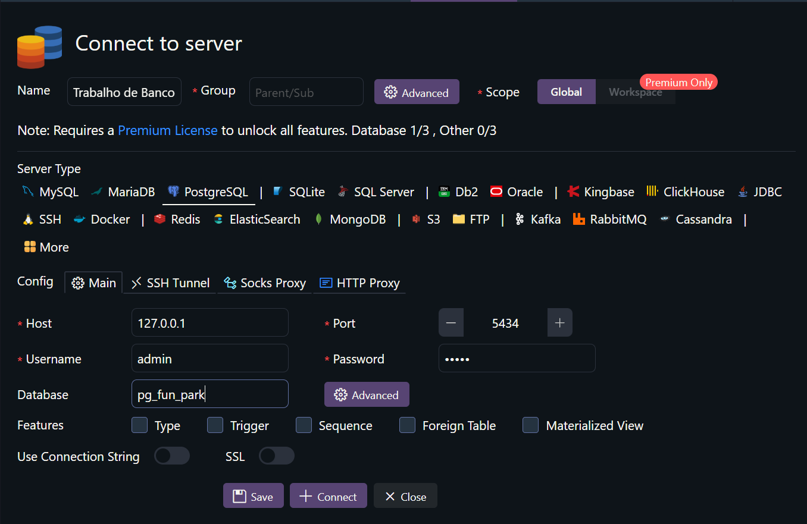

## Como rodar o projeto 

- Clone o projeto no seu computador
- Rode o comando abaixo para criar o container do Banco de Dados no seu computador: 
```
docker-compose up -d
```
- Verifique se seu container está rodando com o comando abaixo
```
docker ps
```
- Abra a extensão **Database Client** em seu VSCode
- Crie uma conexão do docker no Database Client com os dados abaixo:

- Copie o script `create_schemas.sql` e cole np Database Cliente para criar as tabelas do BD
- Copie o script `create_schemas.sql` e cole no Database Cliente para criar as tabelas do BD
- Copie o script `insert_data.sql` e cole no Database Cliente para inserir os dados nas tabelas
- Implemente os selects que forem solicitado a você e os cole no script `select_examples.sql`